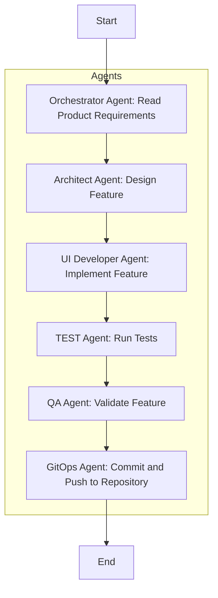

# AI UI Autopilot Flow Diagram

```mermaid
flowchart TD
    A[Start] --> B[Orchestrator Agent: Read Product Requirements]
    B --> C[Architect Agent: Design Feature]
    C --> D[UI Developer Agent: Implement Feature]
    D --> E[TEST Agent: Run Tests]
    E --> F[QA Agent: Validate Feature]
    F --> G[GitOps Agent: Commit and Push to Repository]
    G --> H[End]

    subgraph Agents
        B
        C
        D
        E
        F
        G
    end
```